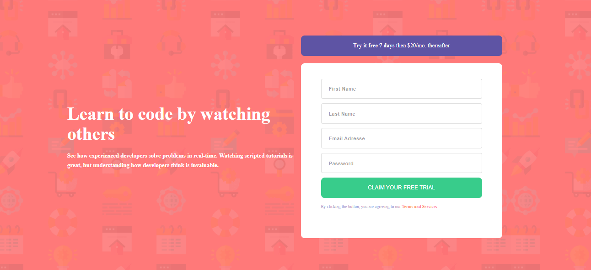

# Title
    Intro-Component-with-SignUp

# Preview of the App

# Description
    FrontendMentor Challenge

# Stack used :
    HTML // CSS // JS

### Fonts :

- Family: [Poppins](https://fonts.google.com/specimen/Poppins)

### Colors :

- Red: hsl(0, 100%, 74%) 
- Green: hsl(154, 59%, 51%)
- Blue: hsl(248, 32%, 49%)
- Dark Blue: hsl(249, 10%, 26%) 
- Grayish Blue: hsl(246, 25%, 77%)

***
***
***
#### Contact info :

##### oussama Amdouni FrontEnd web-developer

[Portfolio]() | [Linkedin](https://www.linkedin.com/in/usama-amdouni/) | [Github](https://github.com/hernon07) | [Frontend Mentor](https://www.frontendmentor.io/profile/hernon07) | [LeetCode](https://leetcode.com/u/hernon07/)
***
***
***
